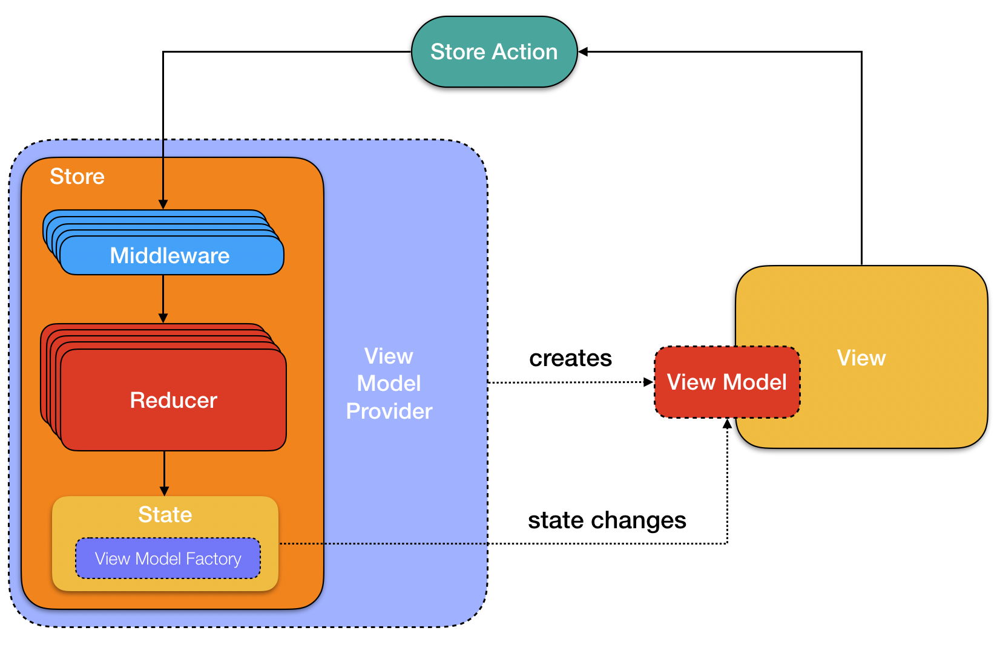
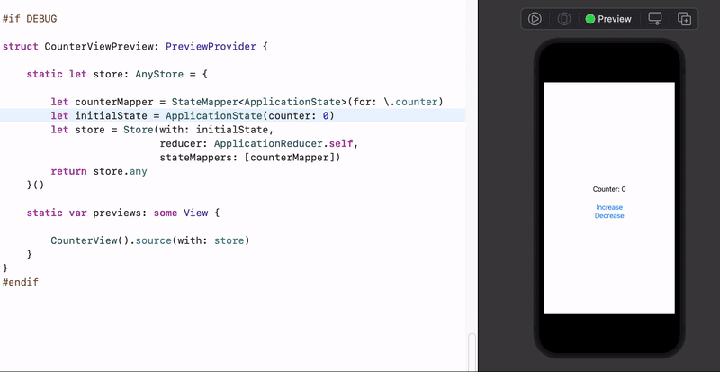
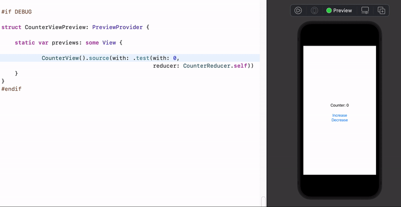
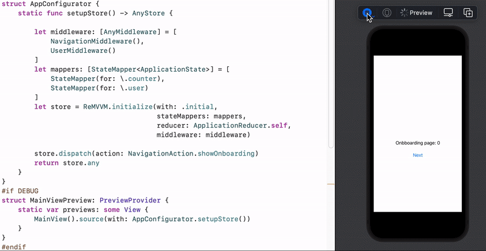

[](https://dgrzeszczak.github.io/ReMVVM)
[](https://github.com/Carthage/Carthage)
[](https://img.shields.io/badge/Swift_Package_Manager-compatible-orange?style=flat-square)

# ReMVVM
 
*ReMVVM* is an application architecture concept, marriage of *Unidirectional Data Flow* (*Redux*) with *MVVM*. 

Redux + MVVM = ReMVVM 

# Motivation 

**Model-View-ViewModel** - is well known and widely used architecture on *iOS* platform. It is very simple, lightweight, doesn’t bring any boilerplate and works well with reactive programming (can be used without it of course). Working on the app which contain more than single view you will find couple of questions: 
* who is responsible to create View Model ? 
* how to pass parameters to View Model’s constructor or fabric ? 
* how to implement switching to the new view ? Where to make view change and how to pass View Model to the View ?

Of course you can find couple patterns to solve that such as coordinator but surprisingly easy you can follow the wrong path.

**Unidirectional Data Flow (UDF)** - the main concept behind is immutable application state that can be changed only in one place in the app (*Store*) and only by predictable plain functions (in *Reducers*) ie. State + Action =  NewState. The most popular implementation of that concept is JavaScript library called *Redux*. The first and most popular swift’s implementation is *ReSwift* by Benjamin Encz. If you are not familiar with that architecture I strongly recommend to look on Benjamin’s [presentation](https://academy.realm.io/posts/benji-encz-unidirectional-data-flow-swift/) and look into [ReSwift](https://github.com/ReSwift/ReSwift) documentation. 

You can find an easy example of *Redux* implementation with incrementing and decrementing single integer value. Let’s imagine you have application with 15-30 screens, all with complicated view structure and communication with backend API. It will bring complicated *Application State*, a lot of *Reducers* and dozens or even hundreds of *Actions* for the state changes. 

But… what about making a mix of two architectures ? Can we implement “global” app state by *Unidirectional Data Flow* and use *MVVM* pattern for each screen in the app with all benefits it has ? We can and it is what *ReMVVM* was made for.

# Components 

For the simplicity, you can think that *Unidirectional Data Flow* part stores global data model state of the app. *View Model* may take that data, listens and reacts on the data change and of course converts and serves it for the *View* layer.

We can divide components on two groups related with *Unidirectional Data Flow* and *MVVM*. 

 

## Unidirectional Data Flow: 
**```Store```** - contains your application state that can be modified only by dispatching an ```StoreAction```. Every state change is notified to every ```StateObserver```.

**```StoreState```** - it’s immutable data structure that holds your application data. In *ReMVVM* it has to provide *```ViewModelFactory```* that will be used for creating View Models for your view(s).

**```StoreAction```** - describes state change and is handled by corresponding *```Reducer```*. 

**```Middleware```** - mechanism for enhance action’s dispatch functionality. It is usually used to simplify asynchronous dispatch and implement ‘side effects’ if required.

**```Reducer```** - provides pure function that returns new state based on current state and the action. 

## MVVM:
**```ViewModel```** - is designed to store and manage UI related data for the view

**```ViewModelProvider```** - provides View Model(s) using ViewModelFactory from current state

**```ViewModelFactory```** - creates View Model instances

# Example

Let’s start with standard „The counter” example. We will implement one *View* that presents the counter value and two buttons to increase and decrease it. We will use *SwiftUI* and *Combine* but we can do it with *UIKit* with or without any other *Reactive* framework. 

Counter value will be stored in application state in Store. View model will be listening on every change and will serve counter’s value as a string value. 

It is extremely easy example. You may feel there is no need to put counter into application state or even there is no need to have view model and that’s true but usually in real life I'm sure you will find the benefits. 

First, we need to define our application state. We don’t need custom ```ViewModelFactory``` so we will use default implementation of ```StoreState``` protocol.

```swift
struct ApplicationState: StoreState {
    let counter: Int
}
```

Second, we need an ```StoreAction``` that will let us to change state. 

```swift
enum CounterAction: StoreAction {
    case increase
    case decrease
}
```

Third, we need a ```Reducer``` that will update counter value based on action.

```swift
enum CounterReducer: Reducer {
    static func reduce(state: Int, with action: CounterAction) -> Int {
        switch action {
        case .increase: return state + 1
        case .decrease: return state - 1
        }
    }
}
```

Then, we can write view model that observes state changes and served mapped value for the view. 

```swift
final class CounterViewModel: ObservableObject, Initializable {

    @Published private(set) var counter: String = ""

    @ReMVVM.State private var state: Int?

    required init() {
        $state.map(String.init).assign(to: &$counter)
    }
}
```

<details>
<summary>Without property wrappers</summary>
  
```swift
final class CounterViewModel: ObservableObject, Initializable, StateObserver {

    @Published private(set) var counter: String = ""

    required init() { }

    func didReduce(state: Int, oldState: Int?) {
        counter = String(state)
    }
}
```

*Please notice ```StateObserver``` declaration!*
</details>

Finally, we can create our view.

```swift
struct CounterView: View {

    @ReMVVM.ViewModel private var viewModel: CounterViewModel!
    @ReMVVM.Dispatcher private var dispatcher

    var body: some View {
        VStack {
            Text("Counter: \(viewModel.counter)")
                .padding(.bottom)

            Button(action: dispatcher[CounterAction.increase]) {
                Text("Increase")
            }
            Button(action: dispatcher[CounterAction.decrease]) {
                Text("Decrease")
            }
        }
    }
}
```
Probably you’ve noticed that we wrote ```Reducer``` for the counter value and view model listens for Int type values instead of the ```ApplicationState```. We could base on ```ApplicationState``` but I would like to present you idea about substates. 

It’s good to separate data as much as possible so we can operate on smaller chunks, so then view model depends only on the required data not the whole state. 

To accomplish that we still need to create ```Reducer``` for ```ApplicationState```. 
```swift
struct ApplicationReducer: Reducer {
    static func reduce(state: ApplicationState, with action: StoreAction) -> ApplicationState {
        ApplicationState(
            counter: CounterReducer.reduce(state: state.counter, with: action)
            //...
        )
    }
}
```
We also need to provide ```StateMapper``` that converts ```ApplicationState``` to our ```Int``` substate. Thanks to this we can observe substate changes in view model.

```swift
let counterMapper = StateMapper<ApplicationState>(for: \.counter)
```
Now, we can initialise store.

```swift
let initialState = ApplicationState(counter: 0)
let store = Store(with: initialState,
                  reducer: ApplicationReducer.self,
                  stateMappers: [counterMapper])
ReMVVM.initialize(with: store)
```

And test it

 

<details>
  <summary>Testing substate reducer</summary>
  
   

</details>

# ReMVVMCore and ReMVVMSwiftUI

ReMVVM project contains two targets: 
* ReMVVMCore - contains ReMVVM implementation plus 'basic versions' of property wrappers that you can use with UIKit  
* ReMVVMSwiftUI - contains property wrappers that should be used with SwiftUI conjunction  

Basically import ReMVVMSwiftUI when using SwiftUI, import ReMVVMCore otherwise.

# Extensions 

Sneak peak for navigation implemented with ReMVVM. 

```CounterView``` has no additional view navigation logic implemented. The view contains additional buttons that just send appropriate actions.

 

<details>
  <summary>Details</summary>
  
Code:
  
```swift
struct CounterView: View {

    @ReMVVM.ViewModel private var viewModel: CounterViewModel!
    @ReMVVM.Dispatcher private var dispatcher

    var body: some View {
        VStack {
            VStack {
                Text("View id: \(viewModel.id)")
                Text("Counter: \(viewModel.counter)")

                Button(action: dispatcher[CounterAction.increase]) {
                    Text("Increase")
                }
                Button(action: dispatcher[CounterAction.decrease]) {
                    Text("Decrease")
                }
            }.padding(.bottom)

            VStack {
                Text("Navigation: -> new CounterView")
                Button(action: dispatcher[Push(with: CounterView())]) {
                    Text("Push new")
                }
                Button(action: dispatcher[Pop()]) {
                    Text("Pop")
                }
                Button(action: dispatcher[ShowModal(view: CounterView())]) {
                    Text("Show new on modal")
                }
                Button(action: dispatcher[ShowModal(view: CounterView(), navigation: true)]) {
                    Text("Show new on modal with nav")
                }
                Button(action: dispatcher[DismissModal()]) {
                    Text("Dismiss modal")
                }
                Button(action: dispatcher[Show(on: Navigation.root, view: CounterView())]) {
                    Text("Show new on root")
                }
                Button(action: dispatcher[NavigationTab.profile.action]) {
                    Text("Show profile tab")
                }
            }
        }
    }
}
```

For the example code please have a look here: [ReMVVMSampleSwiftUI](https://github.com/ReMVVM/ReMVVMSampleSwiftUI)

[ReMVVMExtUIKit](https://github.com/ReMVVM/ReMVVMExtUIKit) navigation implementation used in couple live applications available in AppStore. 

[ReMVVMExtSwiftUI](https://github.com/ReMVVM/ReMVVMExtSwiftUI) is a concept of navigation implementation in pure SwiftUI. 

[ReMVVMSample-iOS](https://github.com/ReMVVM/ReMVVMSample-iOS) is UIKit with RxSwift sample that use [ReMVVMExtUIKit](https://github.com/ReMVVM/ReMVVMExtUIKit).
</details>

# Summary

*ReMVVM* architecture brings great separation between layers. It's clear where to store model data, who and where creates view model and how it's passed to the view. It takes the biggest advantages of two different architectures and makes the code readable without introducing any boilerplate.

